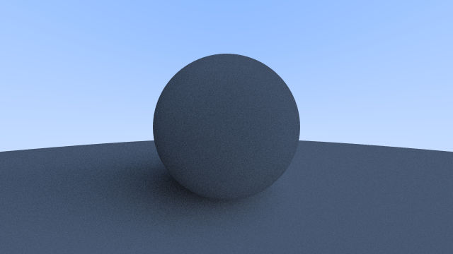
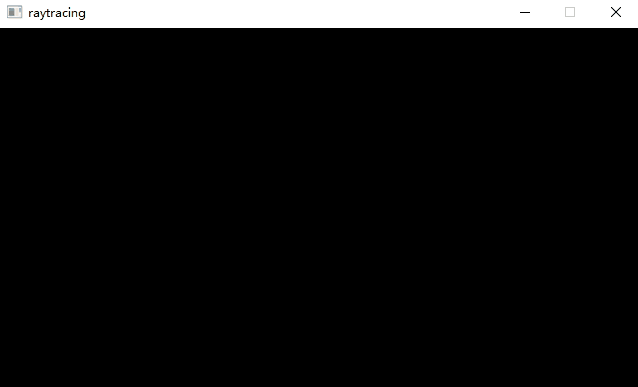
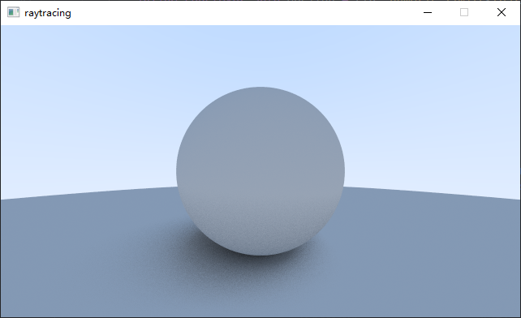
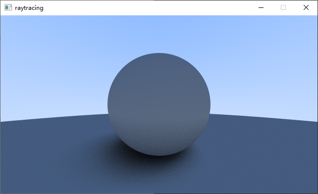
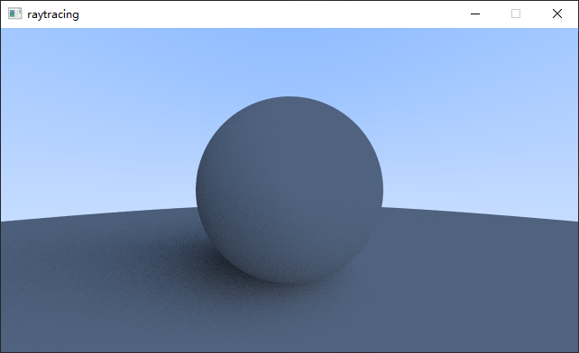
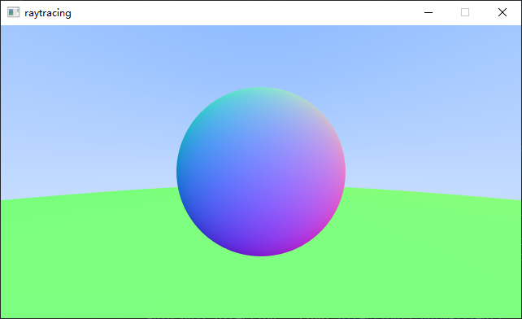
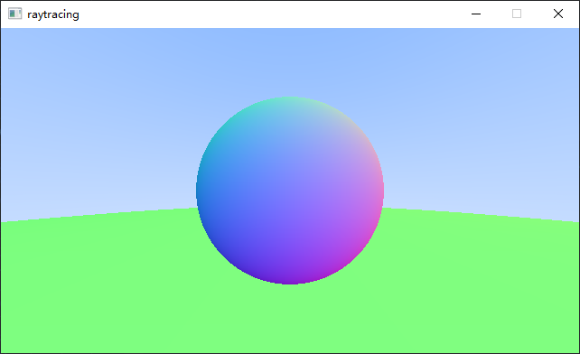
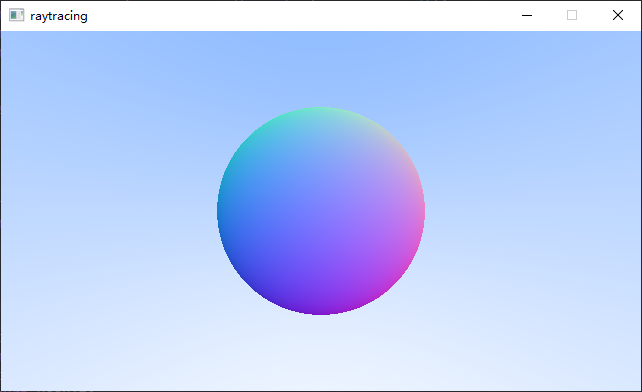
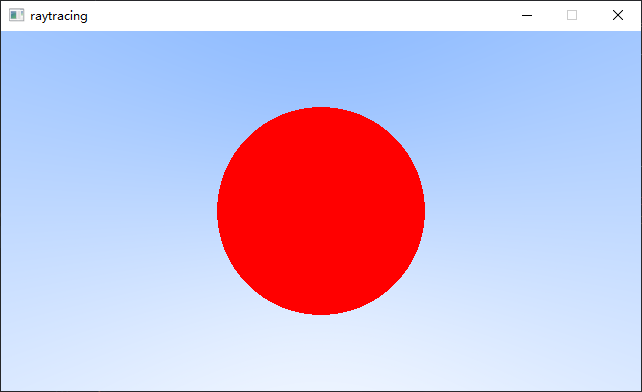

# raytracing

## Render

## History
|           Title            |                    Image                    |
| -------------------------- | ------------------------------------------- |
| Gama Correction            |             |
| Lambertian distribution    |     |
| Diffuse reflection Enhance |  |
| Diffuse reflection         |          |
| Samples per pixel          |           |
| Sphere with ground         |          |
| Normal                     |                      |
| Red sphere                 |                  |
| Sky box                    |                     |
